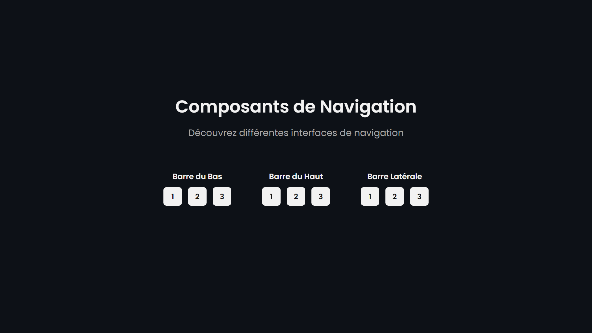

<div align="center"> 
  <a href="https://components-navigation.vercel.app" target="_blank">
    
  </a>
  </br></br>
  <h3 align="center">🧭 Composants de Navigation</h3> 
</div>

## <br /> 📌 Sommaire

&nbsp;&nbsp;&nbsp; 🎨 &nbsp; [**Introduction**](#introduction)<br />
&nbsp;&nbsp;&nbsp; 🛠️ &nbsp; [**Technologies**](#technologies)<br />
&nbsp;&nbsp;&nbsp; 🎯 &nbsp; [**Fonctionnalités**](#fonctionnalités)<br />
&nbsp;&nbsp;&nbsp; 🚀 &nbsp; [**Installation**](#installation)<br />

## <br /> <a name="introduction">🎨 Introduction</a>

Ce projet React regroupe 9 barres de navigation modernes divisées en 3 catégories :

- Barre du Haut : Menu principal en haut de page
- Barre Latérale : Menu latéral fixe ou déroulant
- Barre du Bas : Navigation positionnée en bas pour mobile

Chaque composant est conçu pour être responsive, modulaire et facilement intégrable dans vos projets web (dashboard, app mobile, SaaS...).

## <br /> <a name="technologies">🛠️ Technologies</a>

- React 18 + Vite pour un développement rapide
- React Router DOM + React Icons
- CSS natif modulaire (1 fichier par composant)
- Hooks React : `useState`, `useEffect`, `useRef`
- Convention BEM : `navX__element`
- Déploiement sur [Vercel](https://components-navigation.vercel.app/)

## <br /> <a name="fonctionnalités">🎯 Fonctionnalités</a>

- 9 composants de navigation répartis par type
- Responsive mobile/desktop avec points de rupture optimisés
- Gestion de dropdowns, sous-menus et toggles
- Effets de transition et animations CSS
- Comportements dynamiques (menus actifs, fermeture auto, etc.)
- Système de routage vers chaque variation avec un bouton de retour

## <br /> <a name="installation">🚀 Installation</a>

### ✅ Pré-requis

- 🛠️ **[Git](https://git-scm.com/)**
- 🔧 **[Node.js](https://nodejs.org/fr/)**
- 📦 **[npm](https://www.npmjs.com/)**

### 📥 Cloner le projet

```bash
git clone https://github.com/ValentinMadiot/components-navigation_ui.git
```

### ▶️ Lancer l’application

#### Frontend (port : 5173)

```bash
cd components-navigation_ui
npm install
npm run dev
```
